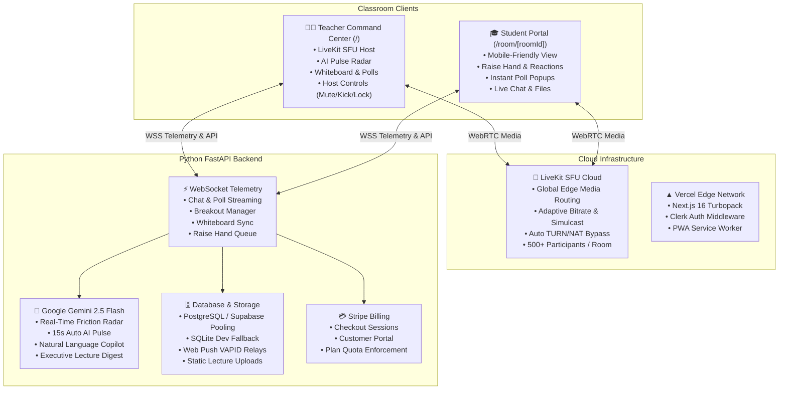

# ClassPulse AI — Production Real-Time Classroom Intelligence & Video Conferencing SaaS

[](https://nextjs.org/)
[](https://fastapi.tiangolo.com/)
[](https://deepmind.google/technologies/gemini/)
[](https://livekit.io/)
[](https://stripe.com/)
[](https://clerk.com/)
[](LICENSE)

**ClassPulse AI** is a real-time classroom conversation intelligence and WebRTC video conferencing platform. It delivers Zoom & Google Meet parity with a zero-lag Selective Forwarding Unit (SFU), live comprehension polling, dual-canvas collaborative whiteboards, breakout sub-rooms, lecture file sharing, push reminders, and automated Google Gemini AI lecture digests.

---

## 🏗️ System Architecture



---

## 🌟 Comprehensive Feature Matrix

### 1. 🎥 Zoom & Google Meet Parity Video Conferencing (LiveKit SFU)
- **Zero-Lag SFU Architecture:** High-concurrency media distribution hosted on LiveKit Cloud edge servers.
- **Gallery & Speaker Layouts:** 1-click toggle between multi-tile grid (`GridLayout`) and speaker spotlight (`FocusLayout`).
- **Screen Sharing & In-Session Recording:** Native 1-click screen broadcast and client-side `.webm` lecture recording download.
- **Host Moderation Panel:** Dedicated controls to **Mute Specific Student**, **Mute All**, **Lock Room**, and **Remove / Kick**.
- **Device Pre-Join Waiting Room:** Camera/mic preview and hardware selector before entering session.

### 2. 🧠 Google Gemini 2.5 Flash AI Engine
- **Real-Time Friction & Sentiment Radar (`POST /rooms/{room_id}/analyze`):** Ingests live chat discussions and extracts summary, main topics, sentiment breakdown, key questions, and action items.
- **Auto AI Pulse (15-Second Loop):** Autonomous background loop triggering analysis when new student messages are detected.
- **In-Lecture AI Copilot (`POST /rooms/{room_id}/ask`):** Teachers can query natural language questions (e.g. *"Who struggled with recursion?"*) citing exact student names and timestamps.
- **Executive Post-Lecture Digest (`POST /rooms/{room_id}/report`):** Synthesizes messages, polls, and participation into structured lecture notes with one-click **`.MD` Download**.

### 3. 🛠️ Interactive Classroom Copilot Tools
- **🖊️ Collaborative Whiteboard (`components/Whiteboard.tsx`):** Real-time synchronized drawing canvas with dual-sync, colors, eraser, marker widths, and touch support.
- **🏠 Breakout Sub-Rooms (`components/BreakoutRooms.tsx`):** Automated group distribution, live countdown timer, and host return broadcast.
- **📁 Classroom File Sharing (`components/FileSharing.tsx`):** Drag-and-drop lecture slides, code files, and PDFs with direct download endpoints.
- **✋ Raise Hand & Live Reactions (`components/RaiseHand.tsx`):** Audience queue with floating animated emoji reactions (👍, ❓, 🎉, 😕, ⏩, ⏸️).
- **📊 Real-Time Comprehension Polls:** Instant polling with real-time percentage progress bar calculations.

### 4. 📅 Calendar & Web Push Notifications
- **Schedule Management:** Full monthly calendar grid with class creation and deletion.
- **5-Minute Class Reminders:** Web Push and WebSocket alerts triggered 5 minutes before scheduled lectures.
- **OS-Level Notifications:** Service worker alerts delivered even with the browser in the background.

### 5. 💳 SaaS Tiers & Stripe Billing
| Plan | Monthly Price | Max Students | Session Duration | Gemini AI Runs | Storage | Included Capabilities |
|------|---------------|--------------|------------------|----------------|---------|-----------------------|
| **Free** | **$0** (Forever) | 10 students | 40 mins / session | 3 runs / day | 1 GB | LiveKit SFU, Live Chat, Polls, Whiteboard (View) |
| **Pro** | **$19** / mo | 500 students | Unlimited | Unlimited | 10 GB | Whiteboard, Breakouts, Recording, File Sharing, AI Pulse |
| **Institute** | **$79** / mo | 500 students | Unlimited | Unlimited | 50 GB | 5 Teacher Seats, Central Admin Panel, Student Profiles |
| **Enterprise** | Custom | 1000+ students | Unlimited | Unlimited | 500 GB | White-label, Custom Domain, Dedicated SLA & API |

---

## 📁 Repository Directory Layout

```
ClassPulse_AI/
├── backend/
│   ├── main.py                  # FastAPI server, LiveKit SFU endpoints, Gemini AI analysis, WebSockets
│   ├── database.py              # PostgreSQL / SQLite connection pooling, SQLAlchemy ORM models & CRUD
│   ├── stripe_service.py        # Stripe subscription tiers, checkout, portal & webhook engine
│   ├── requirements.txt         # All production Python dependencies (FastAPI, livekit-api, stripe, etc.)
│   ├── Procfile & railway.toml  # Cloud deployment specs (Railway / Render)
│   ├── vapid_keys.json          # Web Push encryption keys
│   └── .env.example             # Backend environment template
├── frontend/
│   ├── app/
│   │   ├── layout.tsx           # ClerkProvider wrap & Web Push Service Worker bootstrap
│   │   ├── page.tsx             # Teacher Command Center (Overview, Live Class, Whiteboard, Breakouts, Files, Polls, Reports)
│   │   ├── pricing/page.tsx     # 4-tier pricing page (Zoom-style Free, Pro $19, Institute $79, Enterprise)
│   │   ├── billing/page.tsx     # Subscription usage quotas & Stripe Customer Portal management
│   │   ├── admin/page.tsx       # Institutional analytics & multi-tenant classroom telemetry
│   │   ├── onboarding/page.tsx  # 3-step instructor/student onboarding wizard
│   │   ├── profile/page.tsx     # User credentials & profile management
│   │   ├── manifest.ts          # PWA Web App Manifest (iOS & Android installable)
│   │   └── room/[roomId]/
│   │       └── page.tsx         # Student Portal (LiveKit Video, Chat, Whiteboard, Files, Raise Hand)
│   ├── components/
│   │   ├── LiveKitVideoRoom.tsx # LiveKit SFU Video, Gallery/Speaker, Host Controls, MediaRecorder
│   │   ├── Whiteboard.tsx       # Real-time synchronized drawing canvas
│   │   ├── BreakoutRooms.tsx    # Breakout sub-rooms manager & countdown timer
│   │   ├── FileSharing.tsx      # Classroom file sharing & download center
│   │   ├── RaiseHand.tsx        # Audience doubt queue & live emoji reaction picker
│   │   ├── ScheduleCalendar.tsx # Monthly calendar & event scheduler
│   │   └── NotificationToast.tsx# Animated notification toast system
│   ├── middleware.ts            # Clerk route protection proxy
│   ├── package.json             # Next.js 16, React 19, LiveKit, Clerk, Stripe, tldraw
│   ├── vercel.json              # Vercel deployment spec
│   └── .env.example             # Frontend environment template
└── README.md                    # Master platform architecture & deployment handbook
```

---

## ⚡ Quickstart Local Execution

### 1. Backend Service
```bash
cd backend
python -m venv venv
venv\Scripts\activate          # On Windows
# source venv/bin/activate     # On Linux / macOS
pip install -r requirements.txt
uvicorn main:app --reload --port 8000
```

### 2. Frontend Application
```bash
cd frontend
npm install
npm run dev
```

Open **`http://localhost:3000`** in your browser for the Teacher Command Center or **`http://localhost:3000/room/demo`** for the Student Portal.

---

## 🌐 Production Cloud Deployment Guide

### 1. Deploy Frontend to [Vercel](https://vercel.com)
1. Push this repository to your GitHub account: `https://github.com/manishvmeg/ClassPulse_AI`
2. In Vercel, click **"Add New Project"** → Import `ClassPulse_AI`.
3. Set **Root Directory** to `frontend`.
4. Configure Environment Variables:
   - `NEXT_PUBLIC_API_URL`: `https://your-backend.up.railway.app` (or local for testing)
   - `NEXT_PUBLIC_WS_URL`: `wss://your-backend.up.railway.app`
   - `NEXT_PUBLIC_LIVEKIT_URL`: `wss://classpulse-ai-g0f5s2im.livekit.cloud`
   - `NEXT_PUBLIC_CLERK_PUBLISHABLE_KEY`: `pk_live_...`
   - `CLERK_SECRET_KEY`: `sk_live_...`
5. Click **Deploy**.

### 2. Deploy Backend to [Railway](https://railway.app) / [Render](https://render.com)
1. In Railway, click **"New Project"** → **"Deploy from GitHub repo"**.
2. Set **Root Directory** to `backend`.
3. Configure Environment Variables:
   - `GEMINI_API_KEY`: Google Gemini API Key
   - `LIVEKIT_URL`: `wss://classpulse-ai-g0f5s2im.livekit.cloud`
   - `LIVEKIT_API_KEY`: `APIG8qzW9Pb63xf`
   - `LIVEKIT_API_SECRET`: `HyDWCtfvl4FXGs0glRZTLF4EfC9BusLSwUw9heqTe5oA`
   - `DATABASE_URL`: `postgresql://...` (Supabase / Neon connection string)
   - `STRIPE_SECRET_KEY`: `sk_live_...`

---

## 📄 License
Released under the [MIT License](LICENSE). Built for high-engagement, real-time classroom conversation intelligence.
